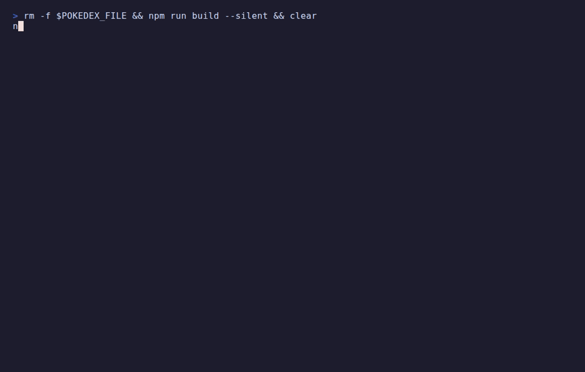

# Pokedex CLI

An interactive Pokedex for your terminal, written in TypeScript on top of the [PokeAPI](https://pokeapi.co). Explore locations, meet wild pokemon, catch them with different balls, make them fight, and keep your collection between sessions.



## Features

- **REPL** with a command registry and built-in `help`
- **Explore** the world: browse location areas and see which pokemon live there
- **Random encounters**: a wild pokemon appears, you choose the ball
- **Four ball types** with different catch odds
- **Battles** between any two pokemon, turn by turn, with speed order and critical hits
- **Persistent Pokedex** saved to disk, restored on next launch
- **In-memory cache** with a background reaper so repeat API calls are instant
- **Unit tests** for the cache, catch odds, battle engine and storage

## Getting started

Requires Node.js 20+.

```bash
git clone https://github.com/Mouin-bkr/pokedex.git
cd pokedex
npm install
npm run dev
```

Other scripts: `npm run build`, `npm start` (runs the built app), `npm test`.

## Commands

| Command | What it does |
| --- | --- |
| `help` | List all commands |
| `map` / `mapb` | Page forward / back through location areas |
| `explore <area>` | List the pokemon found in a location area |
| `encounter <area>` | Meet one random wild pokemon from that area |
| `throw [ball]` | Throw a ball at the current wild pokemon |
| `catch <pokemon> [ball]` | Try to catch a specific pokemon directly |
| `inspect <pokemon>` | Show stats, types and abilities of a caught pokemon |
| `pokedex` | List everything you have caught |
| `battle <a> <b>` | Simulate a fight between two pokemon |
| `exit` | Quit (your Pokedex is already saved after each catch) |

Balls: `pokeball`, `greatball`, `ultraball`, `masterball`.

Example session:

```
Pokedex > encounter pastoria-city-area
A wild remoraid appeared! (water)
Use "throw [pokeball|greatball|ultraball|masterball]" to catch it.
Pokedex > throw ultraball
Throwing an Ultra Ball at remoraid...
remoraid was caught!
Pokedex > battle pikachu charizard
pikachu vs charizard!
charizard is faster and moves first.
-- Round 1 --
charizard hits pikachu for 45. pikachu: 25/70 HP
pikachu hits charizard for 21. Critical hit! charizard: 135/156 HP
-- Round 2 --
charizard hits pikachu for 41. pikachu: 0/70 HP
pikachu fainted! charizard wins!
```

## How it works

**Catch odds.** Chance to catch is `K / (K + base_experience)`, where `K = 100 x ball strength` (pokeball 1x, great ball 1.5x, ultra ball 2x). The curve always stays between 0 and 1: weak pokemon are easy, strong ones get harder but never impossible, and a better ball shifts the whole curve up. The master ball skips the roll and always succeeds. After a failed throw at an encounter, the pokemon has a 25% chance to flee.

**Battles.** Each fighter has `2 x base HP`. The faster pokemon strikes first each round. Damage is `22 x (attack / defense)` with 85-100% random variance, and a 1-in-8 chance of a 1.5x critical hit. The battle engine takes an injectable random function, so tests can replay exact fights.

**Persistence.** Caught pokemon are trimmed down to the fields the app uses and written as JSON to `~/.pokedex.json` after every catch. Set `POKEDEX_FILE` to use a different file. A missing or corrupt save file starts a fresh Pokedex instead of crashing.

**Caching.** API responses are cached for 5 seconds. A `setInterval` reaper evicts stale entries and is stopped cleanly on `exit`.

## Project layout

```
src/
  main.ts, repl.ts, state.ts     REPL loop, command registry, app state
  command_*.ts                   one file per command
  balls.ts                       ball types and catch-chance math (pure)
  battle.ts                      battle engine (pure, injectable RNG)
  storage.ts                     save / load Pokedex to disk
  pokeapi.ts, pokeCache.ts       API client and TTL cache
  tests/                         vitest unit tests
```

Game logic (`balls`, `battle`, `storage`) is kept separate from the command handlers that print to the console, which is what makes it unit-testable.

## Recording the demo GIF

The GIF in this README is generated from [docs/demo.tape](docs/demo.tape) with [VHS](https://github.com/charmbracelet/vhs):

```bash
vhs docs/demo.tape
```

Environment knobs useful while recording: `BATTLE_DELAY_MS` (pause between battle lines, default 400) and `POKEDEX_FILE` (save file path).

## Credits

Built as part of the [Boot.dev](https://boot.dev) "Build a Pokedex" project, then extended with ball types, battles, encounters, persistence and tests. Data from [PokeAPI](https://pokeapi.co).
